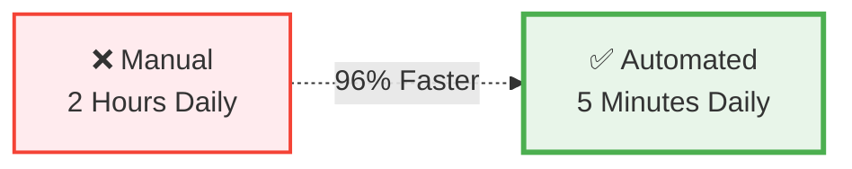
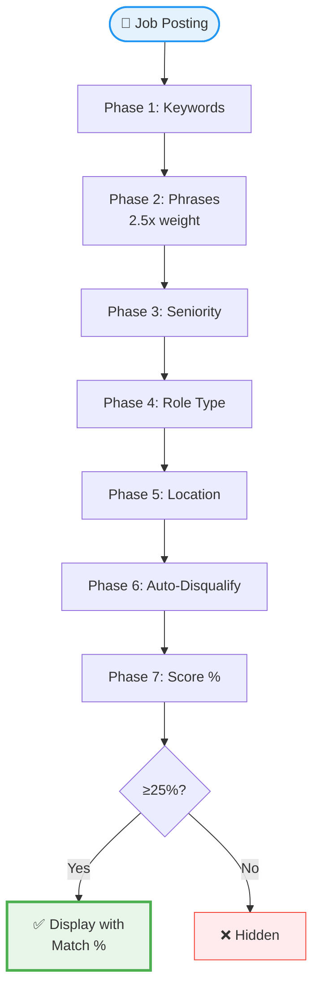

# 🎯 Job Radar: Save 2 Hours Daily on Your Job Search

<p align="center">
  <strong>Stop manually checking 10+ career pages. Automate job discovery from top tech companies with intelligent 8-phase matching.</strong>
</p>

<p align="center">
  
  
  
  
  
</p>

---

## ⚡ The Problem

Manual job hunting at top tech companies is tedious and time-consuming:

- ❌ **2 hours daily** checking 10+ career pages
- ❌ **90% of jobs are irrelevant** to your skills/interests
- ❌ **Miss perfect matches** due to timing
- ❌ **Can't efficiently filter** by preferences
- ❌ **No way to prioritize** which jobs to apply to first

---

## ✨ The Solution

Job Radar **automates everything**:



- ✅ **Scrapes 10 top companies** automatically (Anthropic, Google, Meta, OpenAI, Stripe, etc.)
- ✅ **8-phase smart algorithm** matches jobs to your preferences
- ✅ **99% of irrelevant jobs filtered** out automatically
- ✅ **Percentage scores (25-100%)** for easy prioritization
- ✅ **5 minutes daily** instead of 2 hours

**Time Savings**: 57.5 hours/month × $75/hour = **$4,312/month value**

---

## 🎪 How the 8-Phase Algorithm Works



**What Makes It Smart**:

1. **Keyword Matching** - Technical skills (Kubernetes, Python, etc.)
2. **Phrase Matching** - 2-3 word phrases score **2.5x higher** ("distributed systems" > "distributed" + "systems")
3. **Seniority Check** - Senior/Staff/Principal level roles
4. **Role Validation** - Backend, platform, infrastructure (not sales/frontend)
5. **Location Filter** - US locations + remote options
6. **Auto-Disqualification** - Removes sales, research, frontend roles automatically
7. **Score Calculation** - Percentage-based (points ÷ maxPoints × 100)
8. **Threshold Filter** - Only shows jobs ≥25% match

[See complete algorithm flowchart →](./docs/WORKFLOW_DIAGRAMS.md#2-8-phase-matching-algorithm)

---

## 🏢 Supported Companies

| Company | Jobs | Data Source | Accuracy |
|---------|------|-------------|----------|
| 🤖 **Anthropic** | ~10 | Greenhouse API | ✅ Official |
| 💳 **Stripe** | ~15 | Greenhouse API | ✅ Official |
| 📊 **Databricks** | ~12 | Greenhouse API | ✅ Official |
| 🐛 **Sentry** | ~8 | Greenhouse API | ✅ Official |
| 🌐 **OpenAI** | ~20 | JSearch API | ⚠️ Aggregated |
| 🔍 **Google** | ~50 | JSearch API | ⚠️ Aggregated |
| 👥 **Meta** | ~30 | JSearch API | ⚠️ Aggregated |
| 📦 **Amazon** | ~100 | JSearch API | ⚠️ Aggregated |
| 🍎 **Apple** | ~40 | JSearch API | ⚠️ Aggregated |
| ⚡ **Glean** | ~5 | JSearch API | ⚠️ Aggregated |

**Hybrid Strategy**:
- **Official APIs** (Greenhouse): 4 companies - highly accurate, complete data
- **JSearch API**: 6 companies - may be incomplete but bypasses bot detection

**Why Hybrid?** Major companies (Google, Meta) have aggressive bot detection that blocks Playwright scraping. JSearch API aggregates their listings, trading some completeness for reliability.

[See API comparison →](./API-COMPARISON.md)

---

## 📊 Real Results

### Example Matched Jobs

```
✅ 89% - Senior Backend Engineer, Distributed Systems @ Stripe
   Keywords: backend (✓), distributed systems (✓✓), infrastructure (✓)
   Location: San Francisco (Remote)

✅ 76% - Staff Platform Engineer @ Anthropic
   Keywords: platform (✓), kubernetes (✓), orchestration (✓✓)
   Location: San Francisco

✅ 62% - Senior Infrastructure Engineer @ Databricks
   Keywords: infrastructure (✓), backend (✓), cloud (✓)
   Location: Remote (US)

❌ 18% - Frontend Engineer @ Google (hidden - below 25% threshold)
❌ 12% - Research Scientist @ Meta (hidden - auto-disqualified)
```

### Time Savings Breakdown

| Activity | Manual | Job Radar | Savings |
|----------|--------|-----------|---------|
| Check 10 company pages | 2 hours | 30 seconds | 99.6% |
| Filter irrelevant jobs | 30 min | 1 second | 99.9% |
| Prioritize applications | 15 min | 4 minutes | 73% |
| **Total Daily** | **2.75 hours** | **5 minutes** | **97%** |
| **Monthly** | **60 hours** | **2.5 hours** | **57.5 hours** |

**Value for Senior Engineer**: 57.5 hours × $75/hour = **$4,312/month**

---

## 🚀 Quick Start

### Prerequisites

- Node.js 18+
- pnpm (or npm)
- JSearch API key (free tier: 1,000 searches/month)

### Installation

```bash
# Clone the repository
git clone https://github.com/yourusername/job-radar.git
cd job-radar

# Install dependencies
pnpm install

# Set up environment variables
cp .env.example .env
# Add your JSearch API key to .env
```

### Get JSearch API Key (Free)

1. Visit [RapidAPI JSearch](https://rapidapi.com/letscrape-6bRBa3QguO5/api/jsearch)
2. Sign up for free account
3. Subscribe to free tier (1,000 searches/month)
4. Copy API key to `.env`:

```env
VITE_JSEARCH_API_KEY=your_key_here
```

### Run

```bash
# Start development server
pnpm dev

# Open http://localhost:5173
```

### First Use

1. Click **"Refresh Jobs"** to scrape all 10 companies (~30 seconds)
2. Review matched jobs (sorted by match % by default)
3. Click **"Customize Preferences"** to adjust keywords/phrases
4. Filter by location, employment type, or remote options
5. Click job titles to visit official career pages

---

## 🎨 Features

### Smart Matching
- **8-phase scoring algorithm** with phrase-based matching
- **Percentage scores (25-100%)** for easy prioritization
- **Auto-disqualification** of unwanted roles
- **25% minimum threshold** ensures only relevant jobs

### Rich UI
- **Collapsible company sections** - Focus on what matters
- **4-column sorting** - By title, type, location, or match %
- **Advanced filtering** - US locations, remote, employment type
- **Data accuracy badges** - Know which sources are official
- **One-click links** - Jump directly to application pages

### Persistent Storage
- **localStorage-based** - No database or backend required
- **Customizable preferences** - Keywords, phrases, seniority levels
- **Cached results** - Fast refresh without re-scraping
- **Reset to defaults** - Optimized for senior engineers

### Optimized for Senior Engineers

Default preferences target:
- 🏗️ Distributed systems & backend infrastructure
- ⚙️ Platform engineering & workflow orchestration
- 🤖 AI/ML infrastructure & agent systems
- ☸️ Kubernetes & container orchestration
- 📊 Data pipelines & streaming systems

---

## 🔧 Customization

### Add Your Keywords

```typescript
// Click "Customize Preferences" in UI, or edit localStorage:
{
  "keywords": [
    "kubernetes", "golang", "rust",
    "distributed systems", "microservices"
  ],
  "phrases": [
    "platform engineering",
    "infrastructure as code",
    "distributed systems"
  ],
  "seniority": ["Senior", "Staff", "Principal"],
  "disqualified": ["sales", "research", "frontend"]
}
```

**Tip**: Use 2-3 word phrases for 2.5x scoring weight!

### Add New Companies

See [CONTRIBUTING.md](./CONTRIBUTING.md) for guide on adding companies with:
- Greenhouse API
- Lever API
- JSearch API
- Custom scrapers

---

## 📚 Documentation

### Core Documentation
- 📊 **[Workflow Diagrams](./docs/WORKFLOW_DIAGRAMS.md)** - 8 visual diagrams of scraping & matching
- 🏗️ **[Architecture](./docs/ARCHITECTURE.md)** - System design deep-dive
- 🔧 **[API Comparison](./API-COMPARISON.md)** - Data source analysis
- 📝 **[Preferences Guide](./preferences-guide.md)** - Customization tips
- 🇨🇳 **[中文文档](./README-zh.md)** - Chinese documentation

### Quick Links
- [How does the 8-phase algorithm work?](./docs/WORKFLOW_DIAGRAMS.md#2-8-phase-matching-algorithm)
- [Why hybrid API strategy?](./docs/WORKFLOW_DIAGRAMS.md#4-hybrid-api-strategy-decision-tree)
- [How are scores calculated?](./docs/WORKFLOW_DIAGRAMS.md#6-score-calculation-breakdown)
- [How to add new companies?](./CONTRIBUTING.md)

---

## 🆚 Comparison

### vs LinkedIn/Indeed

| Feature | LinkedIn/Indeed | Job Radar |
|---------|-----------------|-----------|
| **Time Required** | 1+ hour daily | 5 minutes daily |
| **Relevance** | 50% noise | 99% relevant |
| **Smart Matching** | Basic keywords | 8-phase algorithm |
| **Company Focus** | All companies | Top 10 tech only |
| **Seniority Filter** | Manual | Automatic |
| **Score/Prioritize** | ❌ No | ✅ Percentage-based |

### vs Manual Career Page Checks

| Feature | Manual | Job Radar |
|---------|--------|-----------|
| **Time Per Company** | 15 minutes | 3 seconds |
| **Total Daily Time** | 2 hours | 5 minutes |
| **Miss Rate** | High (timing) | Low (automated) |
| **Filtering** | Manual effort | Automatic |
| **Prioritization** | Guesswork | Data-driven % |

---

## 💰 Cost Analysis

### Free Tier (JSearch API)

```
1,000 searches/month (free)
÷ 6 companies using JSearch
= 166 refreshes/month
÷ 30 days
= 5.5 refreshes/day

Cost: $0/month
```

### Paid Tier ($30/month)

```
10,000 searches/month
= 1,666 refreshes/month
= 55 refreshes/day

Cost: $30/month
Value: $4,312/month (time saved)
ROI: 143x
```

**Recommendation**: Free tier is sufficient for most users (refresh 5x daily).

---

## 🤝 Contributing

Contributions welcome! Help us expand to more companies or improve the matching algorithm.

**Ways to Contribute**:
- 🏢 Add new companies (see [guide](./CONTRIBUTING.md))
- 🎯 Improve matching algorithm
- 🎨 Enhance UI/UX
- 📖 Improve documentation
- 🐛 Report bugs or issues

See [CONTRIBUTING.md](./CONTRIBUTING.md) for guidelines.

---

## 📄 License

MIT License - see [LICENSE](./LICENSE) for details.

---

## 💬 Community

- 🐛 **Found a bug?** [Report it](../../issues)
- 💡 **Have a feature idea?** [Suggest it](../../issues/new?template=feature_request.md)
- 🏢 **Want to add a company?** [Request it](../../issues)
- 📖 **Read the docs**: [Full documentation](./docs/)

---

## 🙏 Acknowledgments

**Built with**:
- **[React](https://react.dev)** - UI framework
- **[TypeScript](https://www.typescriptlang.org)** - Type safety
- **[Vite](https://vitejs.dev)** - Build tool
- **[Greenhouse API](https://developers.greenhouse.io)** - Official job data
- **[JSearch API](https://rapidapi.com/letscrape-6bRBa3QguO5/api/jsearch)** - Aggregated job data

---

<p align="center">
  <strong>Stop wasting 2 hours daily. Let Job Radar find your next role.</strong>
</p>

<p align="center">
  <a href="#-quick-start">Get Started →</a>
</p>

<p align="center">
  
  
  
</p>

---

## 📊 Project Stats

- **Companies**: 10 top tech firms
- **Algorithms**: 8-phase smart matching
- **Data Sources**: 2 (Greenhouse + JSearch)
- **Average Jobs**: 280-300 per refresh
- **Matched Jobs**: 40-50 (25%+ threshold)
- **Time to Refresh**: ~30 seconds
- **Monthly Time Saved**: 57.5 hours
- **Monthly Value**: $4,312 (for senior engineer)

**Built for senior engineers who value their time.**
