# Workflow Diagrams - Job Radar

Visual representations of the intelligent job matching and aggregation system.

---

## 1. Complete System Overview

End-to-end job discovery and matching workflow:

```mermaid
graph TB
    Start([🔍 User Starts<br/>Job Search]) --> Scrape[📡 Scrape Jobs<br/>from 10 Companies]

    Scrape --> API{Data<br/>Source?}
    API -->|Official| GH[🟢 Greenhouse API<br/>4 Companies]
    API -->|Aggregated| JS[🟡 JSearch API<br/>6 Companies]

    GH --> Jobs1[📋 Job Listings]
    JS --> Jobs1

    Jobs1 --> Match[🎯 8-Phase<br/>Matching Algorithm]

    Match --> Score[📊 Calculate<br/>Match Score %]
    Score --> Filter{Score<br/>≥ 25%?}

    Filter -->|Yes| Display[✅ Display in UI<br/>Sorted by Match %]
    Filter -->|No| Reject[❌ Auto-Reject]

    Display --> User[👤 User Reviews<br/>& Applies]
    Reject --> End([End])
    User --> End

    style Start fill:#e1f5e1,stroke:#4caf50,stroke-width:3px
    style Match fill:#e3f2fd,stroke:#2196f3,stroke-width:2px
    style Score fill:#fff3e0,stroke:#ff9800,stroke-width:2px
    style Display fill:#e8f5e9,stroke:#4caf50,stroke-width:2px
    style GH fill:#e8f5e9,stroke:#4caf50
    style JS fill:#fff3e0,stroke:#ff9800
```



**Key Stages**:
1. **Scraping**: Multi-source data collection
2. **Matching**: 8-phase intelligent algorithm
3. **Scoring**: Percentage-based ranking
4. **Filtering**: 25% minimum threshold
5. **Display**: User-friendly sorted results

---

## 2. 8-Phase Matching Algorithm

The core intelligence of Job Radar:

```mermaid
flowchart TD
    Job([📄 Job Posting]) --> P1[Phase 1:<br/>Keyword Matching]

    P1 --> Keywords{Contains<br/>Keywords?}
    Keywords -->|Yes +points| P2[Phase 2:<br/>Phrase Matching]
    Keywords -->|No +0| P2

    P2 --> Phrases{Contains<br/>2-3 Word<br/>Phrases?}
    Phrases -->|Yes +2.5x| P3[Phase 3:<br/>Seniority Check]
    Phrases -->|No +1x| P3

    P3 --> Senior{Senior/<br/>Staff/<br/>Principal?}
    Senior -->|Yes +points| P4[Phase 4:<br/>Role Validation]
    Senior -->|No +0| P4

    P4 --> Role{Backend/<br/>Platform/<br/>Infra?}
    Role -->|Yes +points| P5[Phase 5:<br/>Location Filter]
    Role -->|No +0| P5

    P5 --> Location{US or<br/>Remote?}
    Location -->|Yes +0| P6[Phase 6:<br/>Auto-Disqualify]
    Location -->|No -100| Reject1[❌ Rejected]

    P6 --> Disqualify{Sales/<br/>Research/<br/>Frontend?}
    Disqualify -->|Yes| Reject2[❌ Auto-Reject]
    Disqualify -->|No| P7[Phase 7:<br/>Score Calculation]

    P7 --> Calc[📊 points ÷ maxPoints<br/>× 100 = %]
    Calc --> P8[Phase 8:<br/>Threshold Check]

    P8 --> Threshold{Score<br/>≥ 25%?}
    Threshold -->|Yes| Accept[✅ Show Job<br/>with Match %]
    Threshold -->|No| Reject3[❌ Hidden]

    style Job fill:#e3f2fd,stroke:#2196f3,stroke-width:3px
    style Accept fill:#e8f5e9,stroke:#4caf50,stroke-width:3px
    style Reject1 fill:#ffebee,stroke:#f44336
    style Reject2 fill:#ffebee,stroke:#f44336
    style Reject3 fill:#ffebee,stroke:#f44336
    style Calc fill:#fff3e0,stroke:#ff9800,stroke-width:2px
```



**Phase Details**:
- **Phases 1-2**: Content matching (keywords vs phrases)
- **Phases 3-4**: Role targeting (seniority + function)
- **Phase 5**: Geography filtering
- **Phase 6**: Negative filtering (unwanted roles)
- **Phases 7-8**: Scoring and thresholding

**Phrase Matching Power**:
- Single keyword "Kubernetes": +1 point
- Phrase "Kubernetes orchestration": +2.5 points
- Captures context and relevance better

---

## 3. Job Scraping Workflow

Multi-source data collection strategy:

```mermaid
sequenceDiagram
    participant User
    participant UI as 🖥️ React UI
    participant Scraper as 📡 Job Scraper
    participant GH as 🟢 Greenhouse API
    participant JS as 🟡 JSearch API
    participant Cache as 💾 localStorage

    User->>UI: Click "Refresh Jobs"
    UI->>Scraper: fetchAllJobs()

    par Fetch Official APIs
        Scraper->>GH: GET /api/jobs (Anthropic)
        GH-->>Scraper: JSON (10 jobs)
        Scraper->>GH: GET /api/jobs (Stripe)
        GH-->>Scraper: JSON (15 jobs)
        Scraper->>GH: GET /api/jobs (Databricks)
        GH-->>Scraper: JSON (12 jobs)
        Scraper->>GH: GET /api/jobs (Sentry)
        GH-->>Scraper: JSON (8 jobs)
    and Fetch JSearch API
        Scraper->>JS: GET /search (OpenAI)
        JS-->>Scraper: JSON (20 jobs)
        Scraper->>JS: GET /search (Google)
        JS-->>Scraper: JSON (50 jobs)
        Scraper->>JS: GET /search (Meta)
        JS-->>Scraper: JSON (30 jobs)
        Scraper->>JS: GET /search (Amazon)
        JS-->>Scraper: JSON (100 jobs)
        Scraper->>JS: GET /search (Apple)
        JS-->>Scraper: JSON (40 jobs)
        Scraper->>JS: GET /search (Glean)
        JS-->>Scraper: JSON (5 jobs)
    end

    Scraper->>Scraper: Deduplicate & Normalize
    Scraper->>UI: 290 total jobs
    UI->>UI: Run 8-phase matching
    UI->>Cache: Save results
    UI->>User: Display 45 matched jobs (25%+)

    Note over GH,JS: Parallel fetching for speed
    Note over UI: Only matched jobs shown
```



**Fetching Strategy**:
- **Parallel requests**: All 10 companies fetched simultaneously
- **Official APIs first**: Greenhouse for maximum accuracy
- **JSearch fallback**: For companies with bot detection
- **Deduplication**: Remove duplicate listings
- **Normalization**: Standardize data format

---

## 4. Hybrid API Strategy Decision Tree

How Job Radar chooses data sources:

```mermaid
flowchart TD
    Company([🏢 Target Company]) --> Official{Official<br/>API Available?}

    Official -->|Yes| GHCheck{Greenhouse<br/>API?}
    Official -->|No| Playwright{Playwright<br/>Scraping<br/>Possible?}

    GHCheck -->|Yes| UseGH[✅ Use Greenhouse API<br/>Highly Accurate]
    GHCheck -->|No| Lever{Lever<br/>API?}

    Lever -->|Yes| UseLever[✅ Use Lever API<br/>Highly Accurate]
    Lever -->|No| Playwright

    Playwright -->|Yes| BotCheck{Bot<br/>Detection?}
    Playwright -->|No| NoScrape[❌ Cannot Scrape]

    BotCheck -->|Yes| UseJSearch[⚠️ Use JSearch API<br/>May Be Incomplete]
    BotCheck -->|No| UsePlaywright[✅ Use Playwright<br/>Direct Scraping]

    UseGH --> Result([📊 Job Listings])
    UseLever --> Result
    UsePlaywright --> Result
    UseJSearch --> Result
    NoScrape --> Result

    style UseGH fill:#e8f5e9,stroke:#4caf50,stroke-width:2px
    style UseLever fill:#e8f5e9,stroke:#4caf50,stroke-width:2px
    style UsePlaywright fill:#e8f5e9,stroke:#4caf50,stroke-width:2px
    style UseJSearch fill:#fff3e0,stroke:#ff9800,stroke-width:2px
    style NoScrape fill:#ffebee,stroke:#f44336,stroke-width:2px
```



**Current Implementation**:
- **Greenhouse API**: Anthropic, Stripe, Databricks, Sentry (4 companies)
- **JSearch API**: OpenAI, Google, Meta, Amazon, Apple, Glean (6 companies)

**Why Hybrid**:
- **Bot Detection**: Major companies (Google, Meta) block Playwright
- **Accuracy**: Official APIs > Aggregated APIs > Scrapers
- **Reliability**: Less prone to breakage
- **Completeness**: JSearch may miss some listings

---

## 5. System Architecture

Component interaction diagram:


**Technology Stack**:
- **Frontend**: React 19 + TypeScript + Vite
- **Scraping**: Native fetch API
- **Storage**: Browser localStorage (no backend)
- **Matching**: Pure TypeScript logic
- **APIs**: Greenhouse + JSearch REST APIs

---

## 6. Score Calculation Breakdown

How match percentages are calculated:

```mermaid
flowchart LR
    Job([📄 Job Posting]) --> K[Keywords<br/>Matched]
    Job --> P[Phrases<br/>Matched]
    Job --> S[Seniority<br/>Match]
    Job --> R[Role<br/>Type Match]

    K --> KP[+1 pt each<br/>keyword]
    P --> PP[+2.5 pts each<br/>phrase]
    S --> SP[+5 pts if<br/>Senior+]
    R --> RP[+3 pts if<br/>Backend/Platform]

    KP --> Total[∑ Total Points]
    PP --> Total
    SP --> Total
    RP --> Total

    Total --> Max[Max Possible<br/>Points]

    Total --> Calc["Score = (Total ÷ Max) × 100"]
    Max --> Calc

    Calc --> Percent[📊 Match %<br/>25-100%]

    Percent --> Display{Display?}
    Display -->|≥25%| Show[✅ Show with %]
    Display -->|<25%| Hide[❌ Hide]

    style Job fill:#e3f2fd,stroke:#2196f3,stroke-width:2px
    style Calc fill:#fff3e0,stroke:#ff9800,stroke-width:2px
    style Percent fill:#f3e5f5,stroke:#9c27b0,stroke-width:2px
    style Show fill:#e8f5e9,stroke:#4caf50,stroke-width:2px
    style Hide fill:#ffebee,stroke:#f44336
```



**Example Calculation**:

```
Job Title: "Senior Backend Engineer - Distributed Systems"
Location: "San Francisco, CA (Remote)"

Phase 1 - Keywords:
- "backend" → +1 pt
- "distributed" → +1 pt
- "systems" → +1 pt

Phase 2 - Phrases:
- "distributed systems" → +2.5 pts (2 words)
- "backend engineer" → +2.5 pts (2 words)

Phase 3 - Seniority:
- "Senior" → +5 pts

Phase 4 - Role Type:
- "Backend" → +3 pts

Total: 1+1+1+2.5+2.5+5+3 = 16 pts
Max Possible: 20 pts
Score: (16 ÷ 20) × 100 = 80%

Result: ✅ Show job with 80% match
```

---

## 7. Before vs After Comparison

Time savings visualization:


**Quantified Savings**:
- **Manual**: 2 hours daily × 30 days = 60 hours/month
- **Automated**: 5 minutes daily × 30 days = 2.5 hours/month
- **Savings**: 57.5 hours/month (96% reduction)
- **Value**: 57.5 hours × $75/hour = $4,312/month for senior engineer

---

## 8. Data Flow Diagram

Complete data journey from scraping to display:

```mermaid
flowchart TD
    subgraph "Data Sources"
        GH1[Anthropic API]
        GH2[Stripe API]
        GH3[Databricks API]
        GH4[Sentry API]
        JS1[JSearch: OpenAI]
        JS2[JSearch: Google]
        JS3[JSearch: Meta]
        JS4[JSearch: Amazon]
        JS5[JSearch: Apple]
        JS6[JSearch: Glean]
    end

    subgraph "Collection"
        Fetch[Parallel Fetch<br/>10 Companies]
    end

    GH1 --> Fetch
    GH2 --> Fetch
    GH3 --> Fetch
    GH4 --> Fetch
    JS1 --> Fetch
    JS2 --> Fetch
    JS3 --> Fetch
    JS4 --> Fetch
    JS5 --> Fetch
    JS6 --> Fetch

    Fetch --> Norm[Normalize<br/>Data Format]
    Norm --> Dedup[Deduplicate<br/>Listings]
    Dedup --> Raw[290 Raw Jobs]

    Raw --> Match[8-Phase<br/>Matching]
    Match --> Score[Score<br/>Calculation]
    Score --> Filter[Filter<br/>≥25%]
    Filter --> Matched[45 Matched Jobs]

    Matched --> Sort[Sort by<br/>Match %]
    Sort --> Cache[Cache in<br/>localStorage]
    Cache --> Display[Display<br/>in UI]

    Display --> User[👤 User]

    style Fetch fill:#e3f2fd,stroke:#2196f3
    style Match fill:#fff3e0,stroke:#ff9800,stroke-width:2px
    style Matched fill:#e8f5e9,stroke:#4caf50,stroke-width:2px
    style User fill:#f3e5f5,stroke:#9c27b0,stroke-width:2px
```



**Pipeline Stats** (typical run):
- **Input**: 290 raw jobs from 10 companies
- **After deduplication**: 280 unique jobs
- **After matching**: 45 jobs ≥25% match (16% pass rate)
- **Top matches**: 8-12 jobs ≥70% match
- **Processing time**: ~1 second for 280 jobs

---

## Summary

These diagrams illustrate the complete Job Radar system:

1. **System Overview**: End-to-end job discovery workflow
2. **8-Phase Algorithm**: Core intelligent matching logic
3. **Scraping Workflow**: Multi-source data collection
4. **Hybrid Strategy**: API selection decision tree
5. **Architecture**: Component interaction
6. **Score Calculation**: Percentage-based ranking
7. **Time Savings**: Before/after comparison
8. **Data Flow**: Complete pipeline visualization

**Key Takeaways**:
- **Smart**: 8-phase algorithm filters 84% of irrelevant jobs
- **Fast**: 96% time savings (2 hours → 5 minutes)
- **Accurate**: Official APIs for 4 companies, aggregated for 6
- **Scalable**: Parallel fetching, localStorage caching
- **User-Focused**: Percentage scores make prioritization easy

---

**Related Documentation**:
- [Architecture Details](./ARCHITECTURE.md)
- [Algorithm Deep-Dive](./ALGORITHM.md)
- [User Guide](./USER_GUIDE.md)
- [API Comparison](../API-COMPARISON.md)
